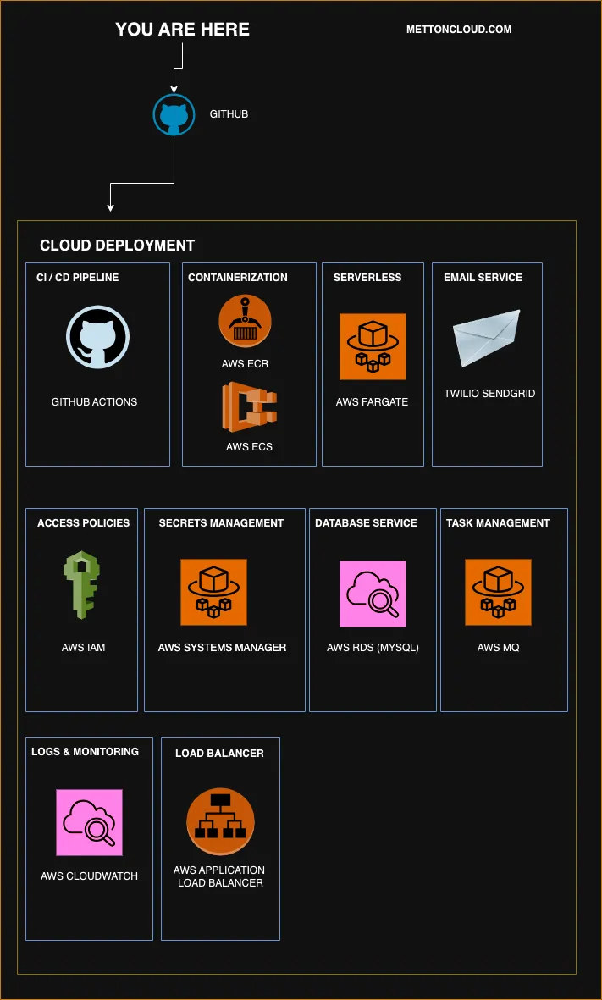

# METTON

A full-stack web app powered by Python and Django, designed to provide seamless and efficient calendar management solution. 

Whether you are a solopreneur, SME, or a startup, Metton helps you optimize your schedules, enhance client interactions, and drive your business forward.

## Technology Stack

- Python
- RabbitMQ / Celery
- PostgreSQL
- Docker
- Django
- Gunicorn
- Nginx
- JavaScript
- Bootstrap 5

## PRODUCTION ARCHITECTURE

This project is currently in alpha stage. More components are continuosly being added or dropped as the need arises.

## DEV Setup

- Clone repo
- Run `cp env.example .env` and fill up details as desired
- Run `chmox +x ./.shell/python_entrypoint.sh`
- Run `docker-compose up --build -d --wait`
- Visit http://127.0.0.1:8080
- For local setup, you make use of the RabbitMQ and PostgreSQL docker images
- In production, we take advantage of AWS infrastrures by using MQ and RDS

## WORKFLOW
- The entire application is fully `containerised`. 
- For `scaling and efficiency` in PROD, I'm taking advangtage of AWS Managed Services for certain components like the Database and Message Queues. 
- For a complete overview of container services available on PROD, please check this file: `ecs-task-definition.json`
- While for a complete overview of container services available on DEV, please check the docker compose file: `docker-compose.yaml`
- `Nginx` acts as a reverse proxy; For Development, this is made possible through port 8080 on the Host machine & port 80 in the container. You can always configure or change this from your `.env` config
- `Nginx` also serves static contents & routes incoming requests to `Gunicorn`
- Django through `Gunicorn` serves the main app on port 8000. The `Python` container EXPOSES port 8000 for this purpose.
- `collectstatic` uses /var/www/static as static volume in PROD. But you don't have to worry about this during development, as Django would serve the assets directly from core/static
- `Python` and `Nginx` both share the same static volume
   

<!-- ## And it comes with a beautiful User Interface you can customize or use straight out the box

#### Landing page

#### All pages are responsive

#### Booking page

#### Manage Schedules

#### Manage Appointments

 -->

## License

[MIT license](https://opensource.org/licenses/MIT).
