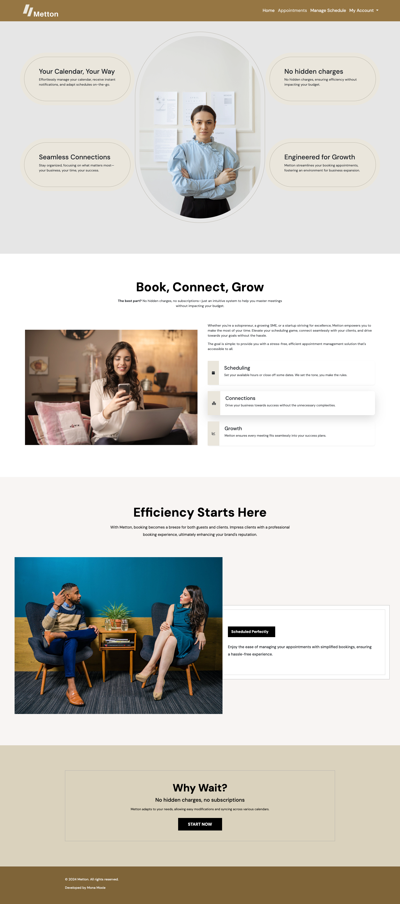
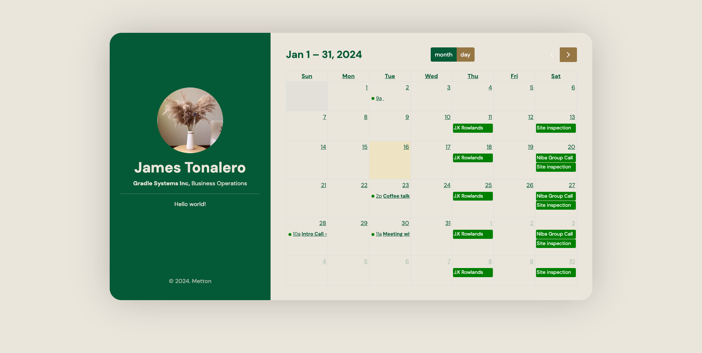
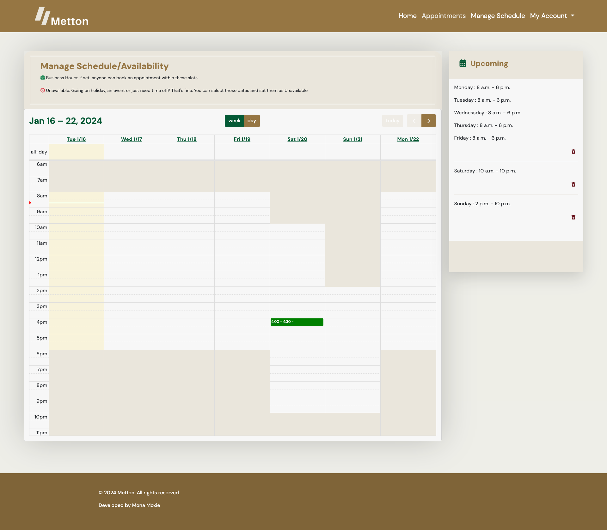
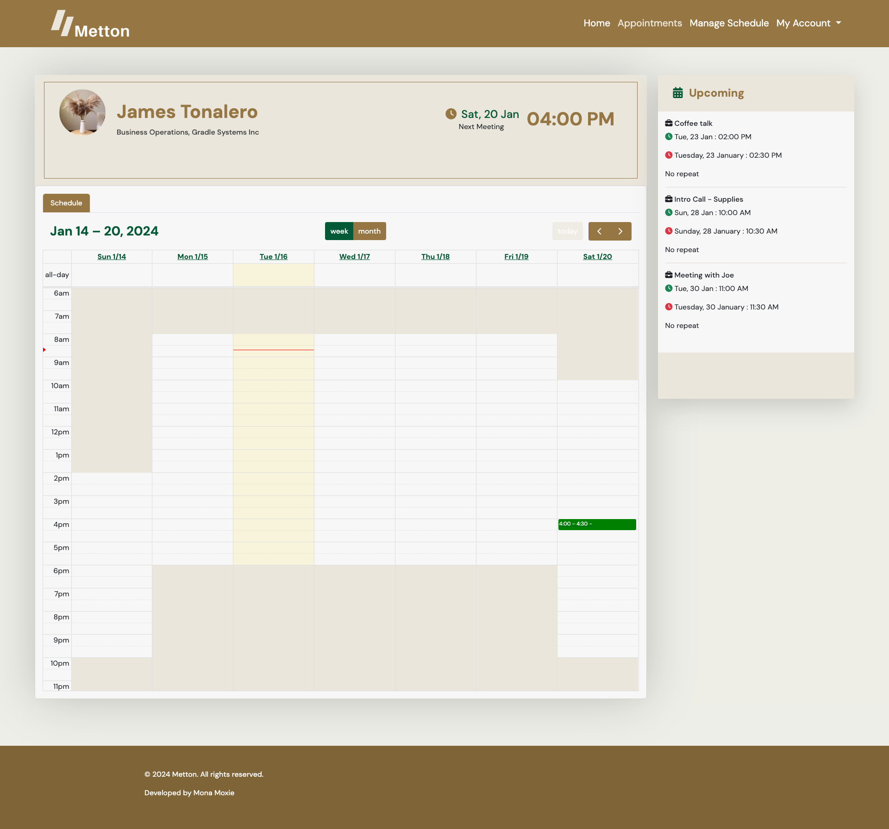

A Python based utility app for receiving, booking and managing calendar schedules. 

## Technology Stack
 
 - Python
 - MySQL
 - Docker
 - Django
 - JavaScript
 - Full Calendar
 - Bootstrap

## Set up Instructions
  - Clone repo
  - Run  `docker-compose up --build -d --wait`
  - Visit localhost:8000

### Architecture - High Level Design 

## And it comes with a beautiful User Interface you can customize or use straight out the box

 #### Landing page

 #### All pages are responsive

 #### Booking page

 #### Manage Schedules

 #### Manage Appointments

## License
Open-sourced and licensed under the [MIT license](https://opensource.org/licenses/MIT).
